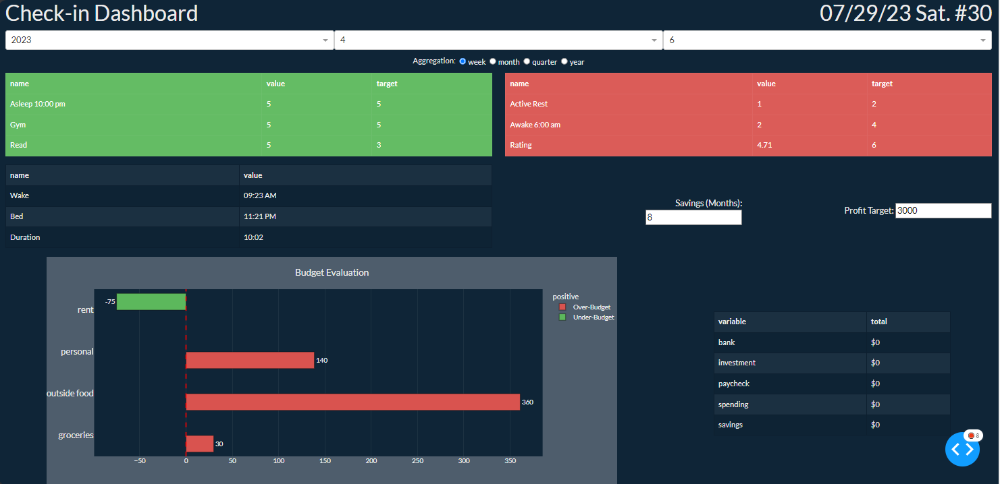

# personal-dashboard
plotly/dash dashboard to display disparate data sources I utilize. Somewhat still a work in progress

Sources include:
-
  - Personal finances with Mint: https://mint.intuit.com/
    - I originally was doing this in R, but decided to move all processing into python. Old R repo is here: https://github.com/johnjmur0/financial-management
      - This repo relies on this other awesome project to scrape data from Mint b/c Mint doesn't have a real API: https://github.com/mintapi/mintapi
     - I then use my other repo to process that raw Mint data, and expose it as an API so from the dashboard's perspective it's the same as all the these other  services.
  - Tasks, schedules, tracking and overall producitivity with Marvin: https://amazingmarvin.com/
    - I really love Marvin. Couldn't recommend it enough.
  - More tracking with Exist: https://exist.io/
    - As I continue using Marvin, I may end up dropping Exist and using Marvin instead.
  - Also I started getting the sleep data from Apple iPhone. It involves one manual step to export from the phone, since they don't have an API

Next steps are to integrate more analysis and stats around budgets and add some financial projections.

NOTE: Since its totally custom to me and connected to these data sources (some of which are subscriptions), please don't try to fork it without letting me know.
If you're interested, I'd be happy to help you get something working on your end, but have no interest in maintaining this for anyone other than myself.

But if you're a Mint, Marvin, Exist user, feel to reach out or checkout how I've processed those. Each were different.

P.S. I wiped the commit history b/c when I was prototying I had some config info hardcoded.

Here's an example of how it looks now (with some made up data):

